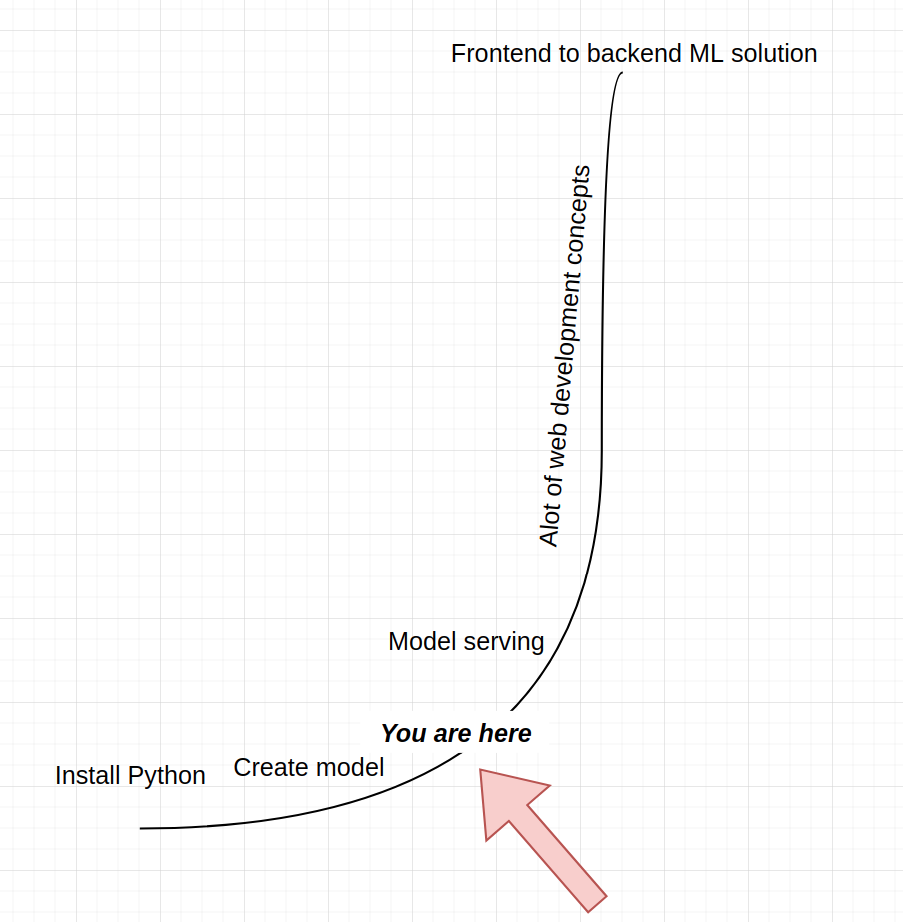

# Serving machine learning 

This book is intended to explain various web development and programming terms in a simple way for a mathematician who is creating machine learning (here and throughout - **ML**) models. 

The term **serving** refers to the process of transfering user requests to the model, get the outputs from the model and return the outputs to the user as a response. Imagine a waiter and a client at the restaurant. What an ML engineer tries to do is to program the waiter to be as efficient as possible in writting down the order, rushing to the kitchen and then returning the ordered meal back. 

This book's emphasis will not be on machine learning parts but more on the programming side. 

# Motivation for writting 

My journey started as a mathematician who was given clean data and the only objective was to select a good ML model, fit the model on data and then interpret the results. For all this I was using the programming language called **R**. During the start of my career, the output of my work was either a **.csv** file or uploading data to a given database.   

As I matured as a professional I wanted to be independant from all the developers around me and start creating my own APIs, manage databases, log modeling results and overall be a better developer - not just a machine learning practitioner. I enrolled into a **Python** course, learned some pandas and scikit-learn and thought that I will become a good web developer overnight and start opening my ML models to the world. 

But this is where I reached a very steep part of the developer learning curve: 

There were alot of new concepts! Most of the documentation which is written for them assumes that a developer is reading them - not a mathematician. I had to dig deep and through sweat, a bit of tears and determination I managed to break into the developer world and start creating production level APIs and Python code.

With this book, I want explain various popular concepts used in web development and API creation for a math grad and not a developer - something I wish I had when I started my developer journey.

I hope that after reading this, alot of statistical folks will get rid of their imposter syndrome as developers and will start creating production ready APIs!